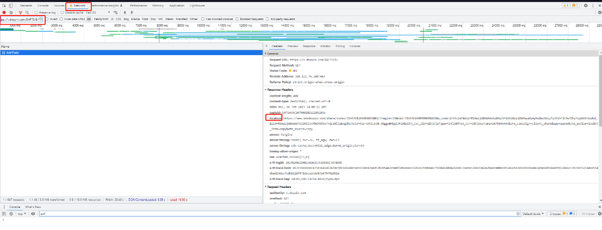
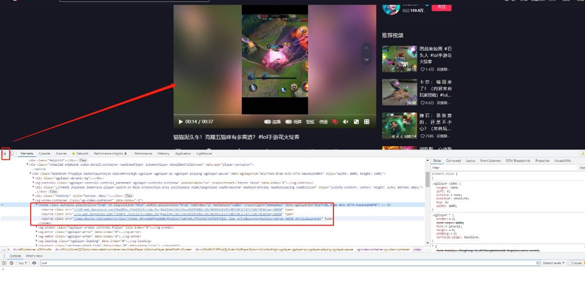
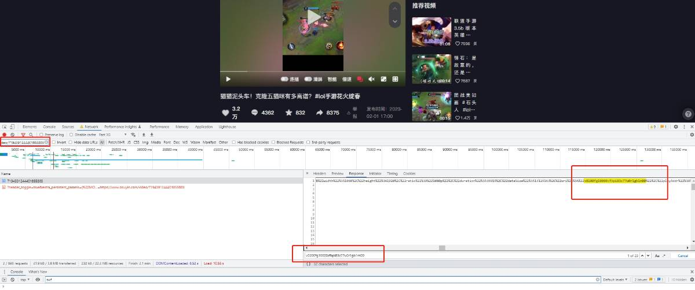

今天用python测试之前使用的抖音无水印视频下载接口"https://www.iesdouyin.com/web/api/v2/aweme/iteminfo/?item_ids="突然发现无法使用了，百度谷歌github等引擎搜索也没看到新的，便开始自己测试抓包分析获取新的接口，运气好找到了。
1.直接手机打开抖音复制了个视频链接 https://v.douyin.com/BAFT5rB/，在电脑谷歌浏览器上先开启了开发者工具，然后打开这个链接进行分析

如上图在network中过滤链接地址，发现会重定向到了新的地址
"https://www.iesdouyin.com/share/video/7194391244401855803/?region=CN&mid=7194392440990698243&u*code=2h54c2af&did=MS4wLjABAAAAxSz8AqJVH299l0pzjDWPayaXykpVuDwc9iLyTyUY2SF1C4w7Ohy7uyGAJn3iWkd*&iid=MS4wLjABAAAATeiGROCtxfBGYO9SxTrQcz0llqEogdhp7wJoP4dprx9VILKJB-dGggxBHQq1JF26&with_sec_did=1&titleType=title&from_ssr=1&timestamp=1675654443&utm_campaign=client_share&app=aweme&utm_medium=ios&tt_from=copy&utm_source=copy"
这个链接测试打开也就是这个地址"https://www.douyin.com/video/7194391244401855803"

 

2.重新打开开发者工具对"https://www.douyin.com/video/7194391244401855803"这个地址再次进行分析

在上图用开发者工具左上角选择元素点击视频，返回对应的视频元素地址有三个，选择了最后一个"https://www.douyin.com/aweme/v1/play/?video_id=v0200fg10000cfbpi83c77u0r1gb1m00&line=0&file_id=cb98f8b868674b8ba31a2c53a2fa28fb&sign=e0139b7f4756344dff15a4174afdd5f3&is_play_url=1&source=PackSourceEnum_AWEME_DETAIL&aid=6383"打开，得到了无水印视频地址,经测试发现只有一个video_id参数就行，所以简单点地址就是"https://www.douyin.com/aweme/v1/play/?video_id=v0200fg10000cfbpi83c77u0r1gb1m00"
所以接口应该就是"https://www.douyin.com/aweme/v1/play/?video_id=" 经过测试多个视频都可以。

 

3.既然知道了接口，如何知道video_id是多少了，后面再次分析之前的数据包，发现在打开"https://www.douyin.com/video/7194391244401855803"这个地址的时候，返回码中刚好有video_id，通过了过滤v0200fg10000cfbpi83c77u0r1gb1m00得到，如图

所以就直接在接口”https://www.douyin.com/aweme/v1/play/?video_id=“上加上video_id就可以得到了无水印地址。

 

相关代码如下，写的有点随意，将就着看

```
import  requests
import  re
 
try:
    url=input('输入链接地址: ')
    obj=re.compile(r"http.*/",re.S)
    url=obj.finditer(url)
    for i in url:
        pid=i.group()
        print(i.group())
    header={"user-agent": "Mozilla/5.0 (Windows NT 10.0; Win64; x64) AppleWebKit/537.36 (KHTML, like Gecko) Chrome/108.0.0.0 Safari/537.36"}
    print('1',pid)
    resp=requests.get(url=pid,headers=header, allow_redirects=False)
    print(resp.text)
    pid=re.finditer(r"video/(?P<IID>.*?)/",resp.text)
    print('2',pid)
    for i in pid:
        ID=i.group('IID')
        print(i.group('IID'))
 
    resp1='https://www.douyin.com/light/'+ID
    print(resp1)
    resp2=requests.get(url=resp1,headers=header)
    c = re.search(r"video_id%3D(?P<IID1>.*?)%26", resp2.text)
    print(c.group('IID1'))
    zq=c.group('IID1')
    urll=f"https://www.douyin.com/aweme/v1/play/?video_id={zq}"
    with open(f'{zq}'+'.mp4','wb') as f :
        m4=requests.get(url=urll,headers=header).content
        f.write(m4)
except:
    print('解析异常')
```